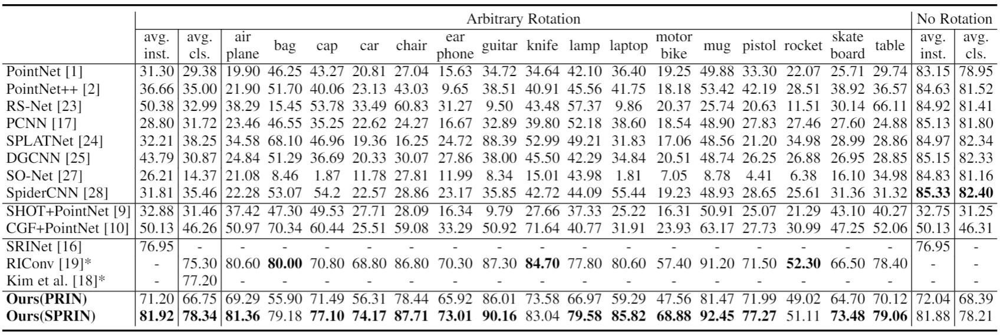
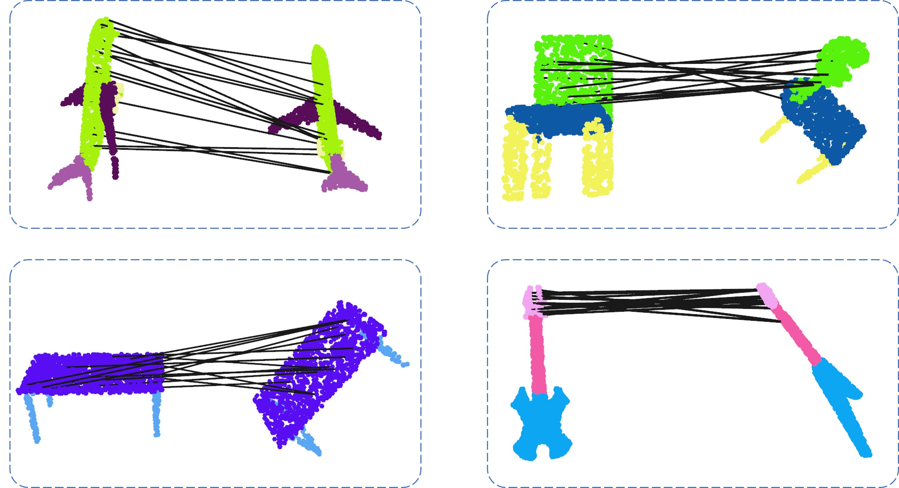

# PRIN/SPRIN: On Extracting Point-wise Rotation Invariant Features

## Overview
This repository is the Pytorch implementation of [PRIN/SPRIN: On Extracting Point-wise Rotation Invariant Features](https://arxiv.org/pdf/2102.12093.pdf)(TPAMI 2021), which is an improved version of [our previous work](https://github.com/qq456cvb/PRIN).

## ShapeNet Part Segmentation results

## Feature Matching Results for PRIN

## Dataset and pretrained weights
* Download ShapeNet part segmentation dataset from https://shapenet.cs.stanford.edu/media/​shapenet_part_seg_hdf5_data.zip
* Pretrained weights for SPRIN can be downloaded from https://drive.google.com/file/d/1ZwN0bJ3UgCJheqYcUrEZyHIH8tEgk3cR/view?usp=sharing
* Pretrained weights for PRIN can be downloaded from https://drive.google.com/file/d/116c80nvL6jAK4T75d5IMudgI8KRcMFa0/view?usp=sharing

## Train and Test for PRIN/SPRIN
Please refer to README under folder ``prin`` and ``sprin``.

## License
MIT

## References
Our paper is available on https://arxiv.org/pdf/2102.12093.pdf.

## Citation
@article{you2021prinsprin,  
&emsp;&emsp;title={PRIN/SPRIN: On Extracting Point-wise Rotation Invariant Features},  
&emsp;&emsp;author={Yang You and Yujing Lou and Ruoxi Shi and Qi Liu and Yu-Wing Tai and Lizhuang Ma and Weiming Wang and Cewu Lu},  
&emsp;&emsp;journal={arXiv preprint arXiv:2102.12093},  
&emsp;&emsp;year={2021}  
}
